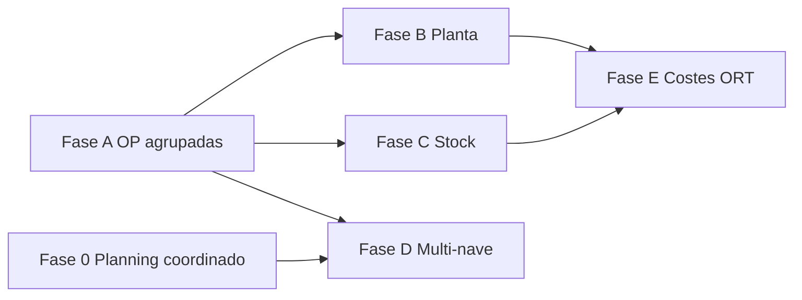

# Roadmap post-MVP — Módulo CEILICA

> **Alcance:** evolución tras el MVP definido en [`Proyecto.md`](Proyecto.md).  
> **Specs:** [`docs/specs/`](specs/) · **Prototipos:** [`docs/reunion/`](reunion/README.md)

## Resumen ejecutivo

| Fase | Nombre | Duración est. | Dependencias |
|------|--------|---------------|--------------|
| **0** | Planning coordinado multi-nave | 2–3 sem | — |
| **A** | Fundamentos OP agrupadas | 2–3 sem | — (paralelo con 0) |
| **B** | Ejecución en planta | 1–2 sem | A |
| **C** | Stock y cancelaciones | 1–2 sem | A |
| **D** | Multi-nave CEILICA | 2–3 sem | **0**, A parcial |
| **E** | Costes avanzados y ORT | 1–2 sem | A, C |

---

## Fase 0 — Planning coordinado multi-nave

**Bloqueante** para lámparas con rutas inter-nave (Fase D).

### Entregables

- `generateCoordinatedPlanning` + action UI
- `loadSolverInput` multi-nave con precedencia global por `lampId`
- Aristas duras N3→N2 (preparación para catálogo SEQ)
- `Planning.planningGroupId` + publicar/deshacer grupo
- Tests: SEQ, paralelo 3 naves, persona multi-nave

### Criterios de aceptación

- [ ] Una acción genera borradores para N1+N2+N3 de la misma semana
- [ ] Tarea N2 SEQ no se asigna antes de fin N3
- [ ] Sin regresión en planning de nave única (modo legacy opcional)
- [ ] Documentación en [`architecture.md`](architecture.md) actualizada

### Archivos clave

- `src/features/planning/service.ts`, `load-engine-input.ts`, `actions.ts`
- `services/planning-solver/`
- `prisma/schema.prisma`

**Spec:** [`specs/planning-coordinado-multinave.md`](specs/planning-coordinado-multinave.md)

---

## Fase A — Fundamentos OP agrupadas

### Entregables

- Migración Prisma: `ProductionOrder` extendido + `ProductionOrderLine`
- Servicio de agrupación (CNC por bastidor, ensamblaje por lámpara)
- UI listado OP con KPIs y filtros (paridad mínima `contract_plus_ops.html`)
- Drawer de detalle
- Confirmación → `TimeEntry` repartido por líneas

### Criterios de aceptación

- [ ] Sugerencia de agrupación CNC entre 2 proyectos misma lámpara/bastidor
- [ ] Crear OP agrupada con líneas y unidades por proyecto
- [ ] FINALIZAR OP imputa horas proporcionales
- [ ] Impresión OP mantiene marca CONTRACT+ / Coverdec

### Archivos clave

- `src/features/production-orders/`
- `src/app/(dashboard)/dashboard/ordenes/`

**Spec:** [`specs/op-agrupacion-y-ejecucion.md`](specs/op-agrupacion-y-ejecucion.md), [`specs/modelo-datos-produccion.md`](specs/modelo-datos-produccion.md)

---

## Fase B — Ejecución en planta

### Entregables

- Vista tablet por operario
- Estados MULTIDAY, INT (pausa/reanudar)
- Sub-OP pintura por RAL (visibilidad pintor)
- Calendario OP semanal
- Generador de OPs con selección de agrupaciones

### Criterios de aceptación

- [ ] Operario ve solo sus OPs del día en tablet
- [ ] INICIAR / CONFIRMAR / PAUSAR / REANUDAR funcionan según spec
- [ ] Imprimación genera un solo lote; pintura divide por RAL
- [ ] Calendario muestra bloques por día/hora

**Spec:** [`specs/op-agrupacion-y-ejecucion.md`](specs/op-agrupacion-y-ejecucion.md)

---

## Fase C — Stock y cancelaciones

### Entregables

- `StockItem` + UI almacén
- OP `kind=STOCK`, parada post-imprimación
- Asignación stock → proyecto
- Cancelación proyecto/unidades con reglas por proceso
- Panel cancelaciones

### Criterios de aceptación

- [ ] OP stock llega a IMPRIMADO y crea semielaborado
- [ ] Asignación traslada horas STOCK + pintura nueva
- [ ] Cancelación post-pintura → stock con color (filtro RAL)
- [ ] Cancelación pre-fabricación reduce OP sin coste

**Spec:** [`specs/stock-y-cancelaciones.md`](specs/stock-y-cancelaciones.md)

---

## Fase D — Multi-nave CEILICA

**Depende de Fase 0.**

### Entregables

- Nave N3 en seed y tipologías corregidas
- `routeType` en catálogo lámparas
- Generación OPs por proyecto (N OPs según ruta)
- OP SEQ N3→N2 con traspaso registrado
- KPIs por nave en panel producción
- Costes por nave (básico)

### Criterios de aceptación

- [ ] Cruz genera 3 OPs; Selcos genera N1 + SEQ
- [ ] Confirmación SEQ registra traspaso N3→N2
- [ ] Planning coordinado + OPs coherentes en misma semana
- [ ] Tarifas/costes por nave en desglose

**Spec:** [`specs/rutas-multinave.md`](specs/rutas-multinave.md)

---

## Fase E — Costes avanzados y ORT

### Entregables

- BOM por lámpara (`BomComponent`)
- Coste plan vs real por proyecto/lámpara/nave
- `kind=ORT` con coste separado
- Dashboard desviación (alimenta análisis futuro M09)

### Criterios de aceptación

- [ ] Coste plan incluye material + MO estándar
- [ ] ORT suma horas sin mezclar con coste estándar
- [ ] Desviación visible por OP y por proyecto

**Spec:** [`specs/modulo-produccion-ceilica.md`](specs/modulo-produccion-ceilica.md)

---

## Gap actual vs objetivo (checklist global)

| Capacidad | MVP | Tras Fase E |
|-----------|-----|-------------|
| Planning semanal OR-Tools | ✓ | ✓ + coordinado multi-nave |
| OP manual simple | ✓ | OP agrupada con líneas |
| Registro horas | ✓ | Vinculado a confirmación OP |
| Fábrica Excel | ✓ | ✓ |
| Stock anticipado | — | ✓ |
| Cancelaciones | — | ✓ |
| 3 naves CEILICA | — | ✓ |
| ORT | — | ✓ |
| BOM / costes | — | ✓ |

---

## Riesgos y mitigaciones

| Riesgo | Mitigación |
|--------|------------|
| Solver multi-nave aumenta complejidad/tiempo | Límite de tareas; timeout; fallback por nave con aviso |
| Doble fuente horas (planning vs OP) | Confirmación OP única vía `TimeEntry` |
| Migración datos OP existentes | Script one-shot; compatibilidad impresión |
| N3 y tipologías en producción | Migración seed + revisión `Task.naveId` históricos |

---

## Próximo paso recomendado

1. Validar specs con cliente (prototipos HTML como referencia visual).
2. Implementar **Fase 0** y **Fase A** en paralelo si hay dos desarrolladores.
3. Demo intermedia: planning coordinado + OP agrupada CNC sin stock.
