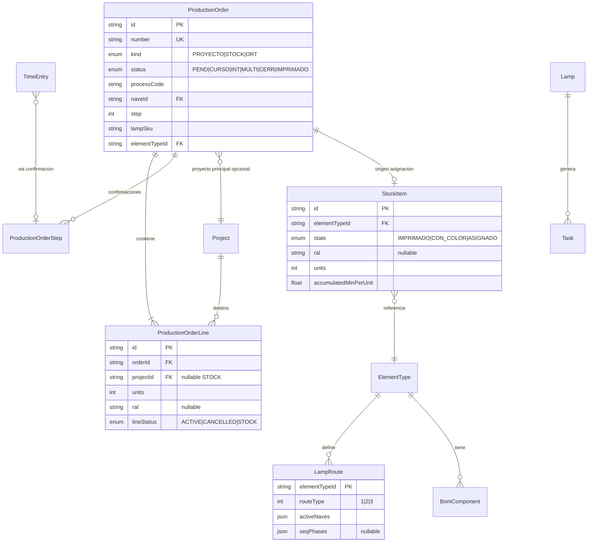

# Modelo de datos — Módulo de producción

> **Estado:** propuesta para implementación post-MVP. No refleja el esquema Prisma actual.

## Diagrama entidad-relación



## Extensiones a modelos existentes

### `ProductionOrder` (reemplazo/evolución del actual)

El modelo actual es mínimo (`projectId`, `lampLabel`, `process`, `hours`). Propuesta:

| Campo | Tipo | Notas |
|-------|------|-------|
| `id` | cuid | |
| `number` | string unique | `OP-2026-0042-CNC` |
| `year`, `serial` | int | Numeración |
| `kind` | enum | `PROYECTO`, `STOCK`, `ORT` |
| `status` | enum | Ver spec OP |
| `processCode` | string? | Proceso principal o null si multi-paso |
| `naveId` | string? | Nave dominante; null si SEQ multi-nave |
| `naveKey` | string? | `N1`, `N2`, `N3`, `SEQ` |
| `elementTypeId` | string? | SKU/bastidor |
| `step` | int | Paso actual en ruta |
| `scheduledWeek` | DateTime? | Enlace opcional a planning |
| `notes` | string? | |
| `parentOrderId` | string? | Sub-OP pintura → OP padre |

Relación con `Project`: opcional a nivel cabecera (OP agrupada); destinos reales en líneas.

### `ProductionOrderLine` (nuevo)

| Campo | Tipo | Notas |
|-------|------|-------|
| `id` | cuid | |
| `orderId` | string FK | |
| `projectId` | string? FK | null = STOCK |
| `clientLabel` | string? | Denormalizado para impresión |
| `units` | int | |
| `ral` | string? | |
| `colorHex` | string? | |
| `lineStatus` | enum | `ACTIVE`, `CANCELLED`, `FULFILLED` |

### `ProductionOrderStep` (nuevo, opcional fase B)

Registro de confirmaciones por paso (alternativa: derivar solo de `TimeEntry`).

| Campo | Tipo |
|-------|------|
| `orderId` | FK |
| `stepIndex` | int |
| `processCode` | string |
| `naveId` | string |
| `confirmedAt` | DateTime |
| `minutes` | float |
| `confirmedByUserId` | string |

### `StockItem` (nuevo)

| Campo | Tipo |
|-------|------|
| `elementTypeId` | FK |
| `state` | `IMPRIMADO`, `CON_COLOR`, `ASSIGNED` |
| `ral`, `colorHex` | nullable |
| `units` | int |
| `accumulatedMinPerUnit` | float |
| `sourceOrderId` | FK? |

### `LampRoute` o campos en `ElementType`

| Campo | Tipo |
|-------|------|
| `routeType` | 1 \| 2 \| 3 |
| `activeNaves` | `N1[]`, `N2[]`, `N3[]`, `SEQ` |
| `materialCostPerUnit` | float? |

### `BomComponent` + `ElementTypeBom` (fase E)

| BomComponent | elementTypeId, componentCode, quantity, unitCost |

### `Planning` (extensión Fase 0)

| Campo nuevo | Tipo |
|-------------|------|
| `planningGroupId` | string? UUID común en generación coordinada |

## Mapeo conceptual

| Concepto CEILICA | Tabla(s) |
|------------------|----------|
| SKU lámpara | `ElementType` (catálogo) + `Lamp` (instancia en proyecto) |
| Línea de proyecto | `Lamp` + unidades + RAL en línea OP o campo en `Lamp` |
| Tarea de planning | `Task` (sin cambio estructural) |
| Confirmación | `TimeEntry` (+ opcional `ProductionOrderStep`) |
| OP agrupada | `ProductionOrder` + `ProductionOrderLine[]` |
| Sub-OP pintura | `ProductionOrder` hijo o mismo con `processCode=PINTURA` + filtro RAL |
| ORT | `ProductionOrder` con `kind=ORT` + `parentOrderId` |

## Precedencia: Task vs OP

```
Planning layer:  Task (lampId, order, naveId) → PlanningAssignment
Execution layer: ProductionOrder → ProductionOrderLine → TimeEntry
```

- **No fusionar** Task y OP en una sola tabla.
- Al confirmar OP, crear `TimeEntry` por proyecto/lámpara/proceso.
- `Task.pendingHours` puede reducirse al confirmar OP (sincronización a definir en Fase A).

## Campos por fase de implementación

| Fase | Modelos |
|------|---------|
| 0 | `Planning.planningGroupId` |
| A | `ProductionOrder` extendido, `ProductionOrderLine` |
| B | `ProductionOrderStep` o flags multiday en Order |
| C | `StockItem`, `kind=STOCK` |
| D | `LampRoute` / `routeType`, Nave N3 |
| E | `BomComponent`, `kind=ORT` |

## Índices recomendados

```prisma
@@index([status, scheduledWeek])
@@index([elementTypeId, processCode])
@@index([planningGroupId])
@@index([orderId, lineStatus])
```

## Migración desde `ProductionOrder` actual

1. Añadir columnas nuevas con defaults (`status=PEND`, `kind=PROYECTO`).
2. Migrar filas existentes: cada OP actual → una línea con `projectId` de cabecera.
3. Deprecar uso directo de `projectId` en cabecera (mantener por compatibilidad impresión).
